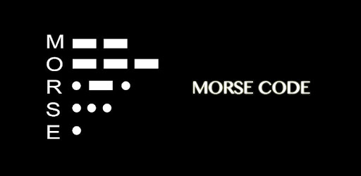

# Morse Code
In this assignment you will create a python script that can decode messages provided in morse code format.  You will also build a low-level translator that is capable of reading key presses from a telegraph switch, and translating them into dots and dashes (short and long press).  This assignment is from a Codewars kata, see References below.

Morse code and telegraphs were widely used in the US in the 1850s and 1860s.  It was the very first telecommunication device, and revolutionized the way people messaged each other.  To this day, it still has its use in some applications, but has mostly replaced with digital data channels.

The Morse code encodes every character as a sequence of "dots" and "dashes". For example, the letter A is coded as `.-`, letter Q is coded as `--.-`, and digit 1 is coded as `.----`. The Morse code is case-insensitive, traditionally capital letters are used. When the message is written in Morse code, a single space is used to separate the character codes and 3 spaces are used to separate words. For example, the message HEY JUDE in Morse code is <code>.... . -.--&nbsp;&nbsp;&nbsp;.--- ..- -.. .</code>

NOTE: Extra spaces before or after the code have no meaning and should be ignored.

# Learning Objectives
- Strings, Loops, Dictionaries
- List Comprehensions
- Applied Regular expressions
- Function chaining
- Principles of DRY and Separation of Concerns


# Instructions

## Part A
Complete the `decode_morse` function within the `morse.py` module provided.  The function accepts a string parameter, which consists of '.' and '-' and ' ' characters arranged to form a morse code message.  The function should use the included MORSE_2_ASCII mapping between Morse letters and alphabetic characters to return an ASCII string which represents the decoded input message.

```
decode_morse(".... . -.--   .--- ..- -.. .") -> "HEY JUDE"
```

Use the built-in tests from this assignment to test your function.  Your `decode_morse` function should pass all of the included unit tests before advancing to part B.

## Part B
Now we are going to extend our use of the decoder function from Part A into real (old) world scenario.  In the age of the telegraph, operators would use telegraph keyswitches to create messages that weree transmitted over wires to a receiving station.  A 'dot' was a short keypress, and a 'dash' was a longer keypress.   Some seasoned operators were able to send their messages very fast, so their dots and dashes were fairly quick.  Newer operators who were just learning Morse code would tend to stretch out their dots and dashes more.  

Morse code is a form of digital communication, meaning that it can be represented purely with 1's and 0's.  A "1" means that the operator is holding the key down for some duration, and "0" means that the key is released.  For this part of the assignment, you will write a function that can distinguish between long keys (dashes) and short keys (dots) and no keys (spaces).  The function will accept a binary sequence of 1s and 0s, for example 

>`0001110001010101000100000001110111010111000101011100010100011101`

The function will transcode the binary sequence into Morse code representation, _taking into account the variable coding speed of the key operator_ (transmission rate) by breaking down the input and examining the duration of sequences of 1s and 0s to decide whether they are dots or dashes.

The return value of `decode_bits` should be a Morse code string.

### Encoding Rules
When transmitting Morse code, the international standard specifies that:
```
    "Dot" – is 1 time unit long.
    "Dash" – is 3 time units long.
    Pause between dots and dashes within a character – is 1 time unit long.
    Pause between characters within a word – is 3 time units long.
    Pause between words – is 7 time units long.
```
Notice there is no mention of what a "time unit" is -- it is up to your function to figure that out.  For this excercise, `Time Unit` is the reciprocal of the transmission rate.  In some cases, a '1' by itself means 'dot' (this would be a fast key operator).  In other cases, '1111' might also mean 'dot' if the key operator is slow.

For example, the message HEY JUDE, that is <code>.... . -.--&nbsp;&nbsp;&nbsp;.--- ..- -.. .</code> may be received as follows:

>`1100110011001100000011000000111111001100111111001111110000000000000011001111110011111100111111000000110011001111110000001111110011001100000011`

In this case, a dot is represented by the sequence `11` because the time unit multiplier is `2`.  Thus, the transmission rate is 1/2.  The information is being tranmitted at half speed, because it takes twice as long for the key operator to encode it.  You will need to compute this, before you can decode the binary message.

To test your `decode_bits` function, you can use the `decode_morse` function from part A to check your Morse code output.

### Hints
- Ignore extra 0's which may occur naturally at the beginning or end of a message.  
- If you have trouble deciding if a particular sequence of 1's is a dot or a dash, _assume it is a dot_.
- For encoding to Morse code, use only the ASCII characters `.` and `-`.  No unicode characters or emojis.
- The Morse code dictionary is already imported for you.  There is a MORSE_2_ASCII and also an ASCII_2_MORSE table.
- All the tests contain valid morse code and binary strings, so don't worry about error checking -- concentrate on decoding the message.


## Testing with Unittest
This assignment also has separate unit tests to help you during development. The unit tests are located in the `tests` folder; you should not modify these.  Make sure all unit tests are passing before you submit your solution. You can invoke the unit tests from the command line at the root of your project folder:
```console
$ python -m unittest discover tests
```
You can also run these same tests using the `Test Explorer` extension built in to the VSCode editor, by enabling automatic test discovery.  This is a really useful tool and we highly recommend to learn it.

https://code.visualstudio.com/docs/python/testing#_test-discovery

- Test framework is `unittest`
- Test folder pattern is `tests`
- Test name pattern is `test*`

## Submitting your work
To submit your solution for grading, you will need to create a github [Pull Request (PR)](https://docs.github.com/en/github/collaborating-with-issues-and-pull-requests/about-pull-requests).  Refer to the `PR Workflow` article in your course content for details.

# References
- [How Morse Code Works and Still Lives On in the Digital Age](https://science.howstuffworks.com/innovation/inventions/morse-code.htm)
- [Codewars Decode the Morse Code](https://www.codewars.com/kata/decode-the-morse-code/python)
- [Codewars Decode the Morse Code, advanced](https://www.codewars.com/kata/decode-the-morse-code-advanced/python)
